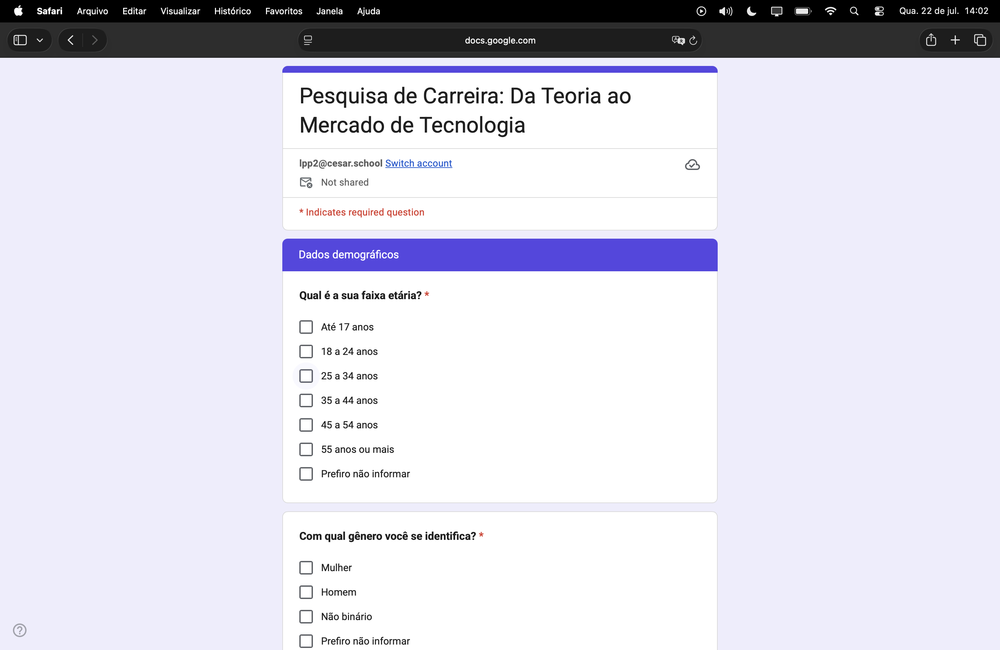
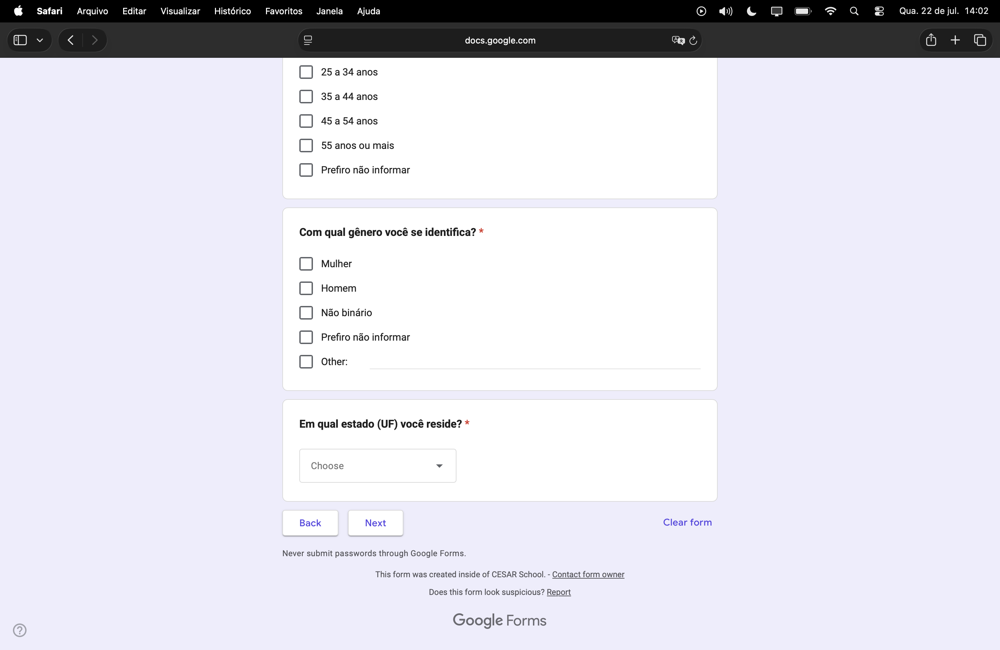
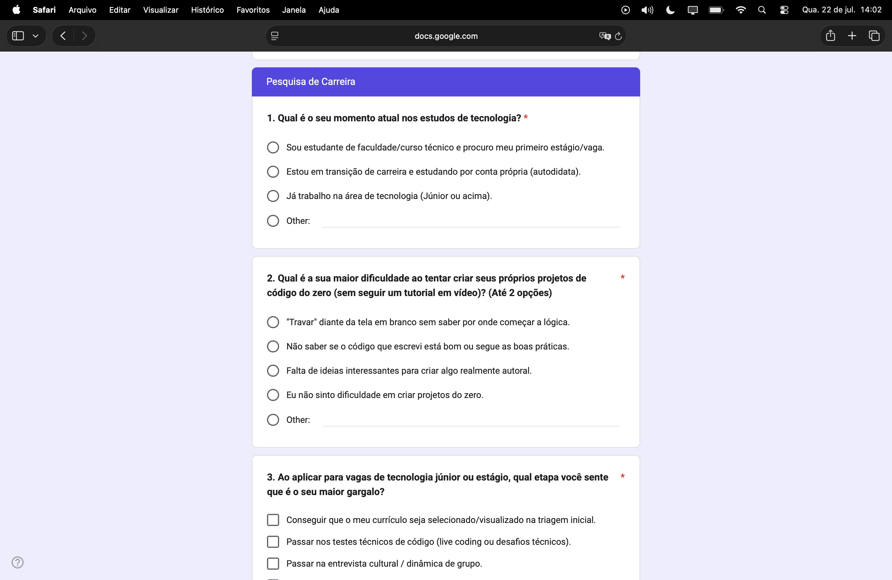
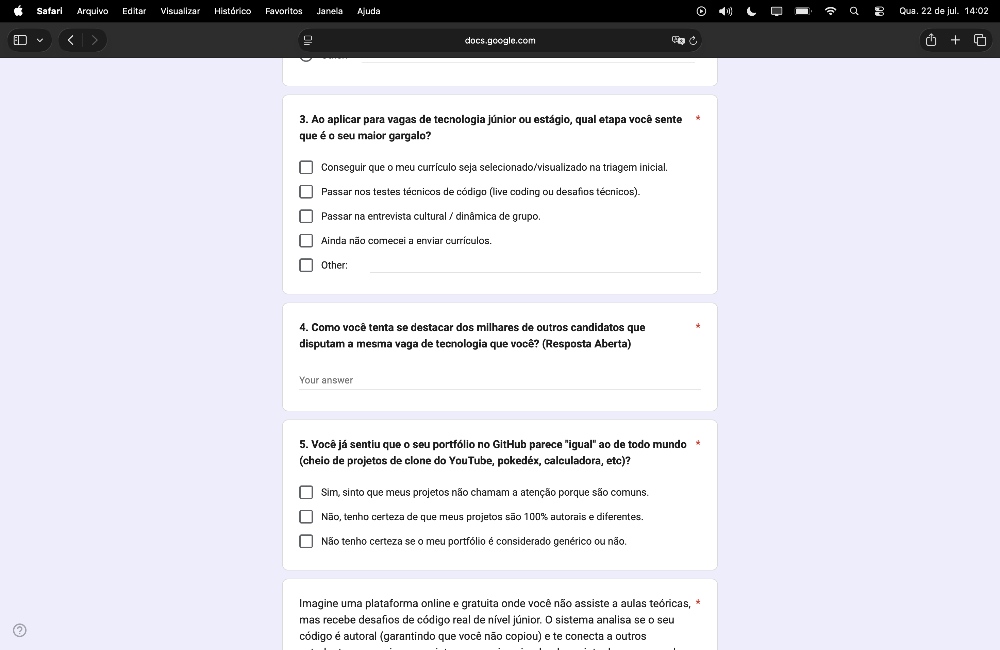
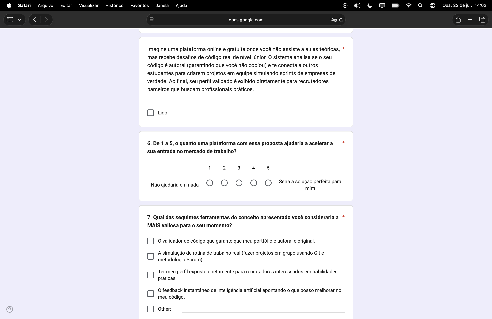
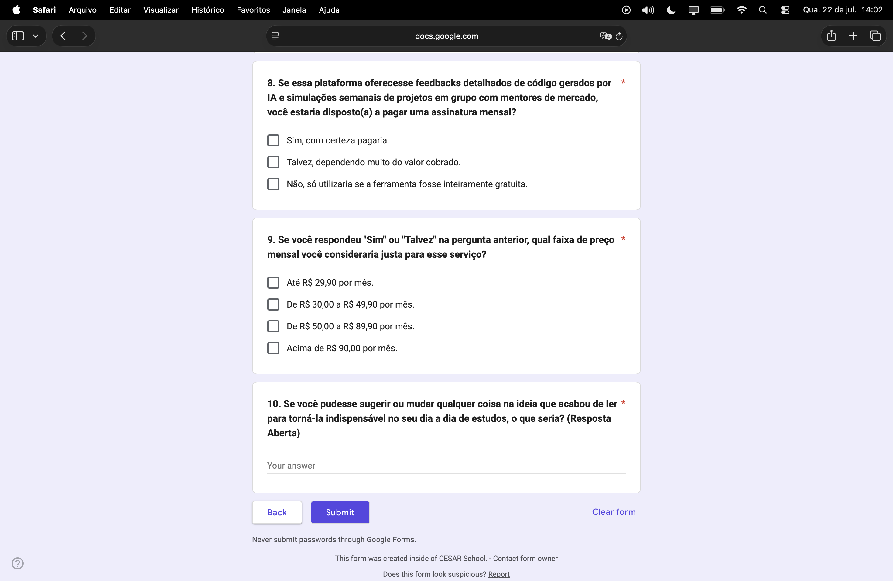

# 📝 Pesquisa de Campo: Da Teoria ao Mercado de Tecnologia

## Parte 1 — O Formulário e o Intuito do Projeto

### 🎯 Objetivo da pesquisa

Antes de escrever a primeira linha de código do **MySTACK**, o time realizou uma pesquisa de campo para validar a dor que o projeto se propõe a resolver: a dificuldade que estudantes e pessoas em transição de carreira enfrentam para sair da teoria (cursos, tutoriais, aulas) e comprovar, na prática, que sabem produzir código autoral de nível júnior para o mercado de tecnologia.

A pesquisa, intitulada **"Pesquisa de Carreira: Da Teoria ao Mercado de Tecnologia"**, foi criada via Google Forms e distribuída para estudantes de cursos técnicos/faculdade, pessoas autodidatas em transição de carreira e profissionais já atuantes na área (júnior ou acima), buscando entender:

- Em que estágio da jornada de carreira em tecnologia a pessoa está;
- Quais são as maiores dificuldades ao criar projetos próprios do zero, sem depender de tutoriais;
- Onde estão os principais gargalos no processo seletivo de vagas júnior/estágio;
- Se a ideia central do MySTACK (validação de código autoral + simulação de rotina real de trabalho + exposição para recrutadores) de fato resolveria essa dor;
- Se haveria disposição de pagamento por um produto com essa proposta, e a qual preço.

Essa pesquisa é a base que orienta as decisões de produto e arquitetura documentadas neste repositório.

### 🧩 Estrutura do formulário

O formulário é dividido em duas seções principais:

1. **Dados demográficos** — faixa etária, gênero e estado (UF) de residência, usados para segmentar as respostas.
2. **Pesquisa de Carreira** — 10 perguntas sobre a jornada profissional do respondente, suas dificuldades práticas e a validação do conceito de produto (a "plataforma" descrita na pergunta de contexto), incluindo uma escala de 1 a 5 de aderência e perguntas sobre intenção de pagamento.

---

### Seção 1 — Dados demográficos

  

- **Qual é a sua faixa etária?** *(obrigatória)* — Até 17 anos, 18 a 24, 25 a 34, 35 a 44, 45 a 54, 55 ou mais, ou "Prefiro não informar".
- **Com qual gênero você se identifica?** *(obrigatória)* — Mulher, Homem, Não binário, Prefiro não informar, ou campo aberto ("Other").

  

- **Em qual estado (UF) você reside?** *(obrigatória)* — campo de seleção (dropdown).

---

### Seção 2 — Pesquisa de Carreira

  

- **1. Qual é o seu momento atual nos estudos de tecnologia?** — estudante buscando primeiro estágio/vaga, pessoa em transição de carreira estudando por conta própria, profissional já atuante (júnior ou acima), ou outro.
- **2. Qual é a sua maior dificuldade ao tentar criar seus próprios projetos de código do zero (sem seguir um tutorial em vídeo)?** *(até 2 opções)* — travar diante da tela em branco, insegurança sobre a qualidade/boas práticas do código, falta de ideias autorais, ausência de dificuldade, ou outro.
- **3. Ao aplicar para vagas de tecnologia júnior ou estágio, qual etapa você sente que é o seu maior gargalo?**

  

- Continuação da pergunta 3 — triagem de currículo, testes técnicos (live coding), entrevista cultural/dinâmica de grupo, ainda não começou a se candidatar, ou outro.
- **4. Como você tenta se destacar dos milhares de outros candidatos que disputam a mesma vaga de tecnologia que você?** *(resposta aberta)*
- **5. Você já sentiu que o seu portfólio no GitHub parece "igual" ao de todo mundo (cheio de projetos clone do YouTube, pokedéx, calculadora, etc)?**

A pergunta seguinte apresenta o **conceito central do produto** que o time pretende validar:

> "Imagine uma plataforma online e gratuita onde você não assiste a aulas teóricas, mas recebe desafios de código real de nível júnior. O sistema analisa se o seu código é autoral (garantindo que você não copiou) e te conecta a outros estudantes para criarem projetos em equipe simulando sprints de empresas de verdade. Ao final, seu perfil validado é exibido diretamente para recrutadores parceiros que buscam profissionais práticos."

  

- Confirmação de leitura do conceito ("Lido").
- **6. De 1 a 5, o quanto uma plataforma com essa proposta ajudaria a acelerar a sua entrada no mercado de trabalho?** — escala de "Não ajudaria em nada" (1) a "Seria a solução perfeita para mim" (5).
- **7. Qual das seguintes ferramentas do conceito apresentado você consideraria a MAIS valiosa para o seu momento?** — validador de código autoral, simulação de rotina de trabalho real (Git + Scrum), exposição direta para recrutadores, feedback de IA sobre o código, ou outro.

  

- **8. Se essa plataforma oferecesse feedbacks detalhados de código gerados por IA e simulações semanais de projetos em grupo com mentores de mercado, você estaria disposto(a) a pagar uma assinatura mensal?**
- **9. Se você respondeu "Sim" ou "Talvez" na pergunta anterior, qual faixa de preço mensal você consideraria justa para esse serviço?** — de "Até R$ 29,90" a "Acima de R$ 90,00".
- **10. Se você pudesse sugerir ou mudar qualquer coisa na ideia que acabou de ler para torná-la indispensável no seu dia a dia de estudos, o que seria?** *(resposta aberta)*

---

## Parte 2 — Respostas e Estatísticas

*A ser preenchido com os dados coletados na pesquisa.*
