<h1 align="center">📝 Pesquisa de Campo: Da Teoria ao Mercado de Tecnologia</h1>

  
  
  

Pesquisa de campo aplicada pelo time antes do início do desenvolvimento do <b>MySTACK</b>, para validar a dor do produto junto a estudantes, autodidatas em transição de carreira e profissionais de tecnologia. Veja o <a href="../README.md">README principal</a> do projeto.

<h2 align="center">Parte 1 — O Formulário e o Intuito do Projeto  
</h2>

<h3 align="center">🎯 Objetivo da pesquisa</h3>

Antes de escrever a primeira linha de código do **MySTACK**, o time realizou uma pesquisa de campo para validar a dor que o projeto se propõe a resolver: a dificuldade que estudantes e pessoas em transição de carreira enfrentam para sair da teoria (cursos, tutoriais, aulas) e comprovar, na prática, que sabem produzir código autoral de nível júnior para o mercado de tecnologia.

A pesquisa, intitulada **"Pesquisa de Carreira: Da Teoria ao Mercado de Tecnologia"**, foi criada via Google Forms e distribuída para estudantes de cursos técnicos/faculdade, pessoas autodidatas em transição de carreira e profissionais já atuantes na área (júnior ou acima), buscando entender:

- Em que estágio da jornada de carreira em tecnologia a pessoa está;
- Quais são as maiores dificuldades ao criar projetos próprios do zero, sem depender de tutoriais;
- Onde estão os principais gargalos no processo seletivo de vagas júnior/estágio;
- Se a ideia central do MySTACK (validação de código autoral + simulação de rotina real de trabalho + exposição para recrutadores) de fato resolveria essa dor;
- Se haveria disposição de pagamento por um produto com essa proposta, e a qual preço.

Essa pesquisa é a base que orienta as decisões de produto e arquitetura documentadas neste repositório.

<h3 align="center">🧩 Estrutura do formulário</h3>

O formulário é dividido em duas seções principais:

| Seção | Conteúdo |
|---|---|
| **1. Dados demográficos** | Faixa etária, gênero e estado (UF) de residência, usados para segmentar as respostas. |
| **2. Pesquisa de Carreira** | 10 perguntas sobre a jornada profissional do respondente, suas dificuldades práticas e a validação do conceito de produto (a "plataforma" descrita na pergunta de contexto), incluindo uma escala de 1 a 5 de aderência e perguntas sobre intenção de pagamento. |

<h4 align="left">Seção 1 — Dados demográficos  
</h4>

  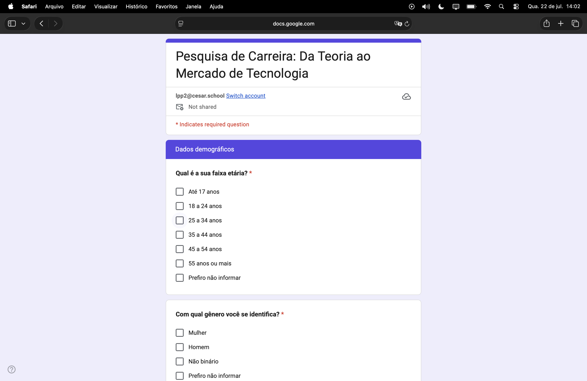

| Pergunta | Obrigatória | Opções |
|---|---|---|
| Qual é a sua faixa etária? | Sim | Até 17 anos, 18 a 24, 25 a 34, 35 a 44, 45 a 54, 55 ou mais, ou "Prefiro não informar". |
| Com qual gênero você se identifica? | Sim | Mulher, Homem, Não binário, Prefiro não informar, ou campo aberto ("Other"). |

  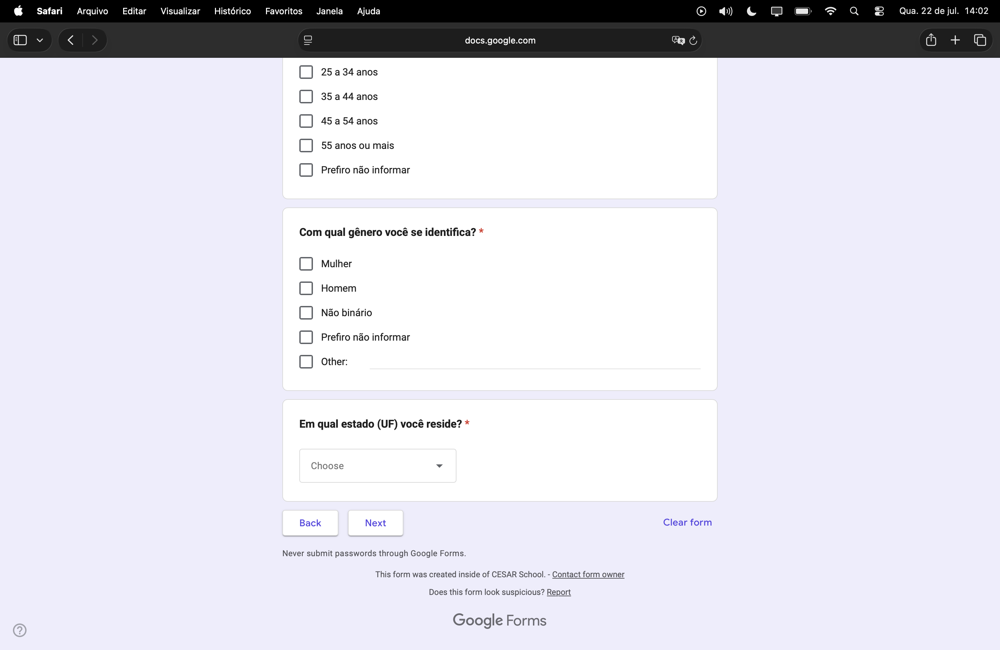

| Pergunta | Obrigatória | Formato |
|---|---|---|
| Em qual estado (UF) você reside? | Sim | Campo de seleção (dropdown). |

<h4 align="left">Seção 2 — Pesquisa de Carreira  
</h4>

  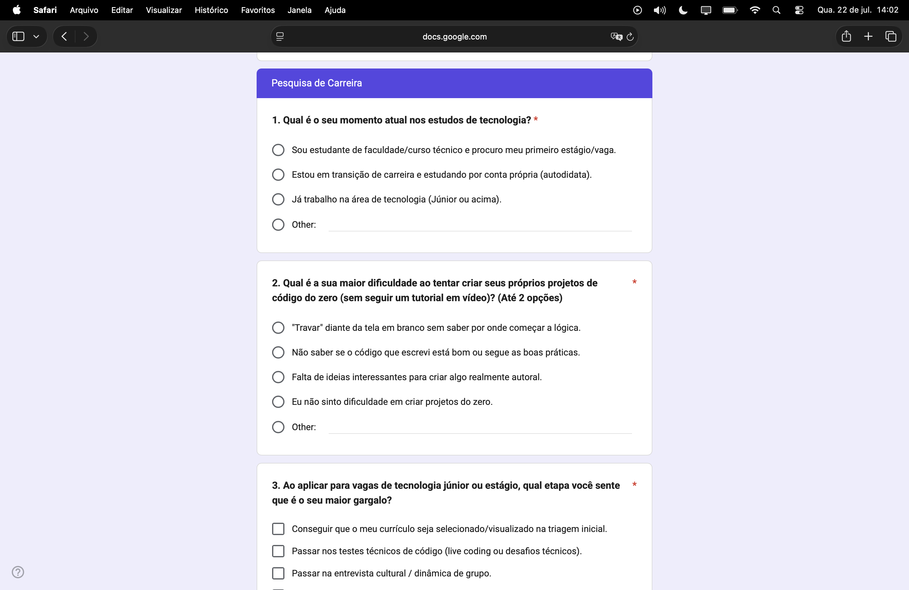

| # | Pergunta | Opções |
|---|---|---|
| 1 | Qual é o seu momento atual nos estudos de tecnologia? | Estudante buscando primeiro estágio/vaga, pessoa em transição de carreira estudando por conta própria, profissional já atuante (júnior ou acima), ou outro. |
| 2 *(até 2 opções)* | Qual é a sua maior dificuldade ao tentar criar seus próprios projetos de código do zero (sem seguir um tutorial em vídeo)? | Travar diante da tela em branco, insegurança sobre a qualidade/boas práticas do código, falta de ideias autorais, ausência de dificuldade, ou outro. |
| 3 | Ao aplicar para vagas de tecnologia júnior ou estágio, qual etapa você sente que é o seu maior gargalo? | *(continua na imagem seguinte)* |

  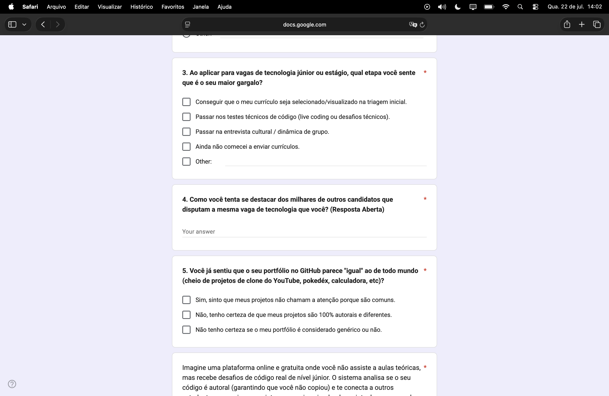

| # | Pergunta | Opções |
|---|---|---|
| 3 *(cont.)* | — | Triagem de currículo, testes técnicos (live coding), entrevista cultural/dinâmica de grupo, ainda não começou a se candidatar, ou outro. |
| 4 *(resposta aberta)* | Como você tenta se destacar dos milhares de outros candidatos que disputam a mesma vaga de tecnologia que você? | — |
| 5 | Você já sentiu que o seu portfólio no GitHub parece "igual" ao de todo mundo (cheio de projetos clone do YouTube, pokedéx, calculadora, etc)? | — |

A pergunta seguinte apresenta o **conceito central do produto** que o time pretende validar:

> "Imagine uma plataforma online e gratuita onde você não assiste a aulas teóricas, mas recebe desafios de código real de nível júnior. O sistema analisa se o seu código é autoral (garantindo que você não copiou) e te conecta a outros estudantes para criarem projetos em equipe simulando sprints de empresas de verdade. Ao final, seu perfil validado é exibido diretamente para recrutadores parceiros que buscam profissionais práticos."

  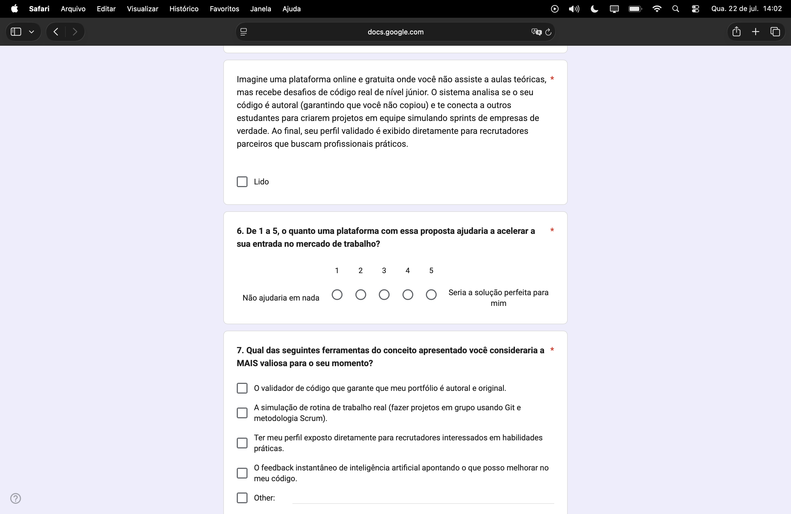

| # | Pergunta | Opções |
|---|---|---|
| — | Confirmação de leitura do conceito | "Lido". |
| 6 *(escala 1-5)* | De 1 a 5, o quanto uma plataforma com essa proposta ajudaria a acelerar a sua entrada no mercado de trabalho? | De "Não ajudaria em nada" (1) a "Seria a solução perfeita para mim" (5). |
| 7 | Qual das seguintes ferramentas do conceito apresentado você consideraria a MAIS valiosa para o seu momento? | Validador de código autoral, simulação de rotina de trabalho real (Git + Scrum), exposição direta para recrutadores, feedback de IA sobre o código, ou outro. |

  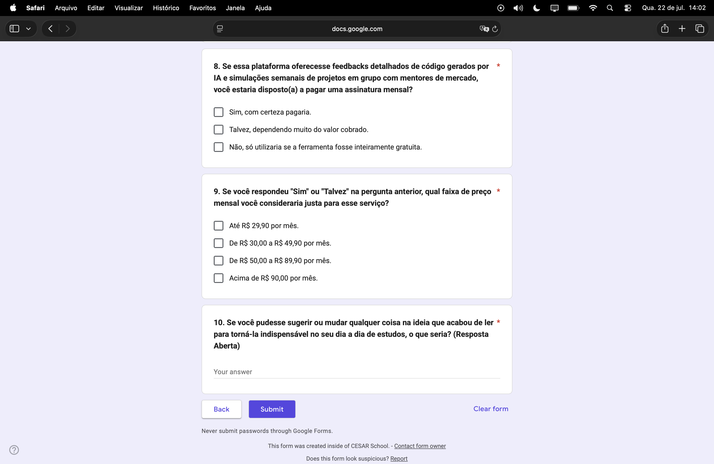

| # | Pergunta | Opções |
|---|---|---|
| 8 | Se essa plataforma oferecesse feedbacks detalhados de código gerados por IA e simulações semanais de projetos em grupo com mentores de mercado, você estaria disposto(a) a pagar uma assinatura mensal? | Sim / Talvez / Não. |
| 9 | Se você respondeu "Sim" ou "Talvez" na pergunta anterior, qual faixa de preço mensal você consideraria justa para esse serviço? | De "Até R$ 29,90" a "Acima de R$ 90,00". |
| 10 *(resposta aberta)* | Se você pudesse sugerir ou mudar qualquer coisa na ideia que acabou de ler para torná-la indispensável no seu dia a dia de estudos, o que seria? | — |

<h2 align="center">Parte 2 — Respostas e Estatísticas  
</h2>

A pesquisa recebeu **31 respostas** válidas. Abaixo estão os dados coletados via Google Forms, com a leitura de cada gráfico e o que ele indica para o desenvolvimento do MySTACK.

  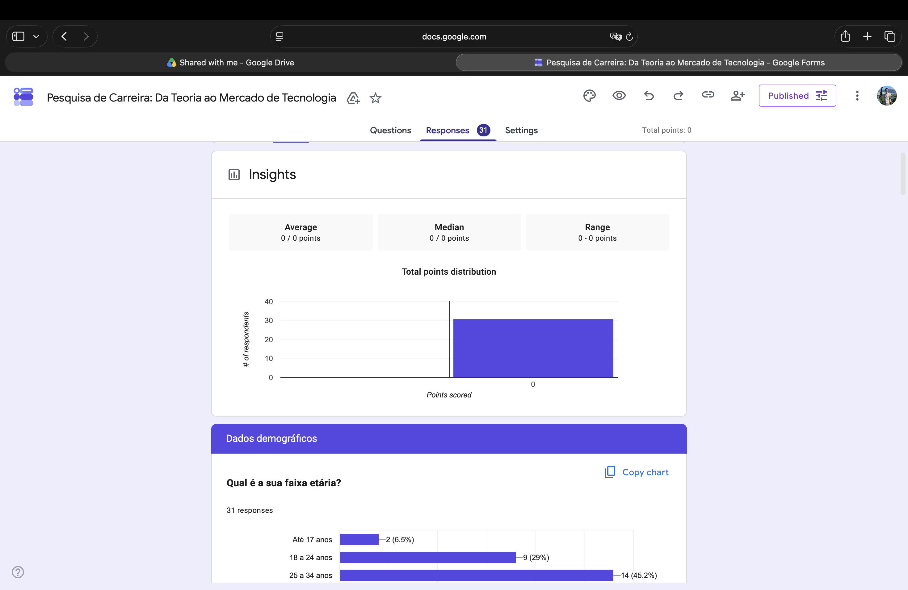

O painel de **Insights** do Forms confirma o total de 31 respondentes. As métricas de pontuação (Average, Median, Range) aparecem zeradas porque o formulário não usa correção automática — é uma pesquisa de opinião, não um quiz —, então esses campos podem ser ignorados.

<h3 align="center">👥 Dados demográficos</h3>

  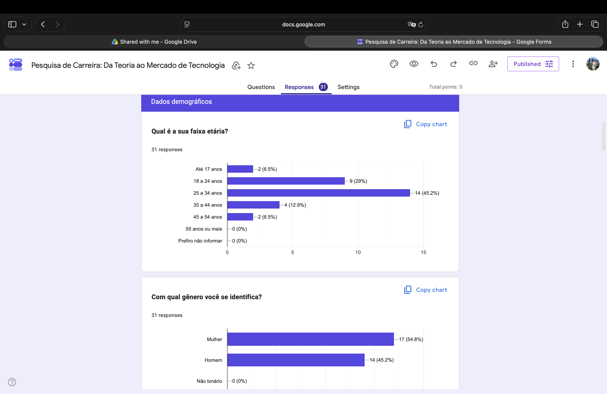

**Qual é a sua faixa etária?**

| Faixa etária | Respostas | % |
|---|---|---|
| Até 17 anos | 2 | 6,5% |
| 18 a 24 anos | 9 | 29% |
| 25 a 34 anos | 14 | 45,2% |
| 35 a 44 anos | 4 | 12,9% |
| 45 a 54 anos | 2 | 6,5% |
| 55 anos ou mais | 0 | 0% |
| Prefiro não informar | 0 | 0% |

Quase três quartos dos respondentes (**74,2%**) têm entre 18 e 34 anos, com pico entre 25 e 34 anos. Isso indica que o público que mais sentiu a dor da pesquisa não é o estudante recém-saído do ensino médio, mas sim adultos jovens já engajados em alguma trajetória de estudo ou transição de carreira — reforçando a hipótese de que o MySTACK deve falar diretamente com quem já testou cursos/tutoriais e busca uma validação prática, e não com iniciantes absolutos.

  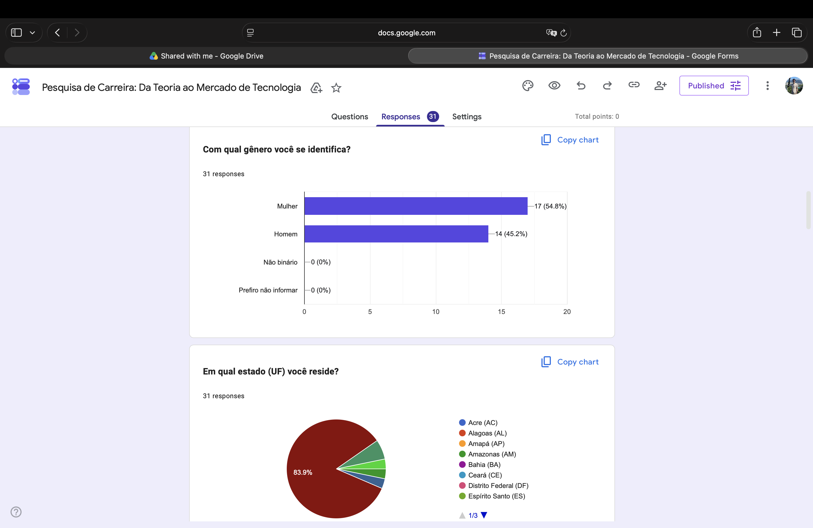

**Com qual gênero você se identifica?**

| Gênero | Respostas | % |
|---|---|---|
| Mulher | 17 | 54,8% |
| Homem | 14 | 45,2% |
| Não binário | 0 | 0% |
| Prefiro não informar | 0 | 0% |

A amostra ficou quase equilibrada entre os gêneros, com leve maioria feminina (54,8%). Vale notar que esse equilíbrio não reflete necessariamente a proporção de gênero do mercado de tecnologia como um todo, mas sim da rede de distribuição da pesquisa — algo a considerar ao extrapolar as demais respostas para o público-alvo real do produto.

**Em qual estado (UF) você reside?**

O gráfico de pizza mostra forte concentração geográfica: **83,9%** das respostas vêm de um único estado, com o restante (~16,1%) pulverizado entre poucos outros estados listados na legenda (Acre, Alagoas, Amapá, Amazonas, Bahia, Ceará, Distrito Federal, Espírito Santo, entre outros, cada um com fatias residuais). Isso é esperado dado que a pesquisa foi distribuída principalmente dentro da rede próxima do time — a amostra é regionalmente concentrada, não nacional, então as conclusões sobre preço e proposta de valor devem ser tratadas como um sinal local, não uma validação de mercado nacional.

<h3 align="center">🧩 Pesquisa de Carreira — Perguntas 1 a 4</h3>

  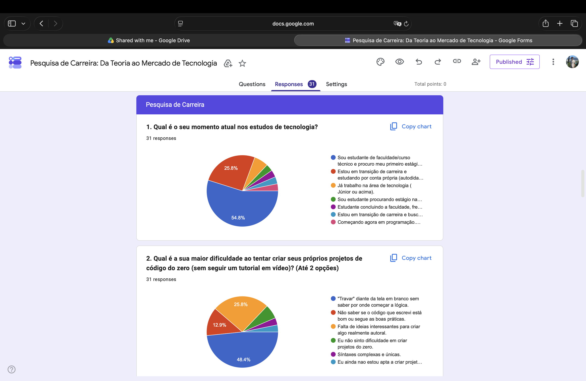

**1. Qual é o seu momento atual nos estudos de tecnologia?**

A maioria absoluta, **54,8%**, respondeu "Sou estudante de faculdade/curso técnico e procuro meu primeiro estágio/vaga", seguida por **25,8%** em "Estou em transição de carreira e estudando por conta própria (autodidata)". O restante (~19,4%) se espalha entre variações de "já trabalho na área", "concluindo a faculdade" e respostas abertas equivalentes. Isso confirma que o público majoritário do MySTACK ainda não conseguiu a primeira oportunidade — o produto precisa priorizar a jornada de "primeiro emprego" antes de features voltadas a quem já está empregado.

**2. Qual é a sua maior dificuldade ao tentar criar seus próprios projetos de código do zero (sem seguir um tutorial em vídeo)? (até 2 opções)**

| Dificuldade | % |
|---|---|
| "Travar" diante da tela em branco sem saber por onde começar a lógica | 48,4% |
| Falta de ideias interessantes para criar algo realmente autoral | 25,8% |
| Não saber se o código escrito está bom ou segue boas práticas | 12,9% |
| Demais opções ("não sinto dificuldade", "sintaxes complexas", "ainda não apta") | ~12,9% (residual) |

Juntas, "travar na tela em branco" e "falta de ideias autorais" somam mais de 74% das respostas. É a validação mais direta da dor central do produto: o gargalo não é falta de conhecimento técnico isolado, é a ausência de um ponto de partida guiado que ainda exija autoria real — exatamente a lacuna que o desafio de código autoral do MySTACK pretende preencher.

  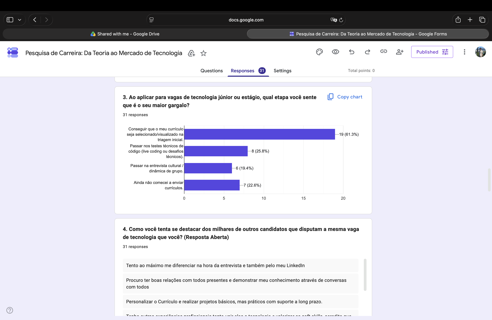

**3. Ao aplicar para vagas de tecnologia júnior ou estágio, qual etapa você sente que é o seu maior gargalo?**

| Etapa | Respostas | % |
|---|---|---|
| Conseguir que o currículo seja selecionado/visualizado na triagem inicial | 19 | 61,3% |
| Passar nos testes técnicos de código (live coding ou desafios técnicos) | 8 | 25,8% |
| Ainda não comecei a enviar currículos | 7 | 22,6% |
| Passar na entrevista cultural / dinâmica de grupo | 6 | 19,4% |

*(Os percentuais somam mais de 100% porque a pergunta permite mais de uma seleção.)* A triagem de currículo é disparadamente o maior gargalo percebido — mais que o dobro da segunda colocada. Isso sugere que, para o recrutador parceiro do MySTACK, o valor mais imediato não é só validar código: é dar ao candidato um jeito de furar a triagem inicial (ex: perfil validado exibido direto para recrutadores, sem depender de um currículo tradicional ser notado em meio a milhares).

**4. Como você tenta se destacar dos milhares de outros candidatos que disputam a mesma vaga de tecnologia que você? (resposta aberta)**

Amostra de respostas coletadas:

> "Tento ao máximo me diferenciar na hora da entrevista e também pelo meu LinkedIn."

> "Procuro ter boas relações com todos presentes e demonstrar meu conhecimento através de conversas com todos."

> "Personalizar o Currículo e realizar projetos básicos, mas práticos com suporte a longo prazo."

As respostas abertas reforçam um padrão: os candidatos recorrem a estratégias manuais e pouco escaláveis (networking, personalização artesanal de currículo, comportamento em entrevista) por falta de um diferencial objetivo e verificável — o tipo de prova de competência que o MySTACK se propõe a gerar automaticamente.

<i>As perguntas 5 a 10 (aderência à proposta da plataforma, ferramenta mais valiosa, intenção de pagamento, faixa de preço e sugestões abertas) ainda não têm capturas de tela cadastradas neste documento. Assim que as imagens de resposta correspondentes forem adicionadas em <code>img/</code>, esta seção deve ser complementada com a mesma estrutura de tabela + leitura usada acima.</i>

  

